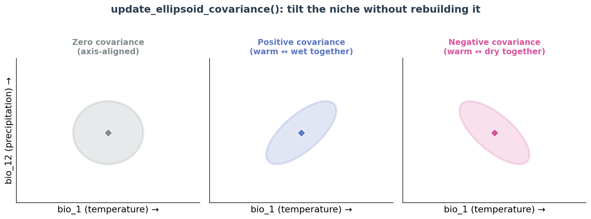

```{r setup, include=FALSE}
# ---------------------------------------------------------------------------
# GLOBAL CHUNK OPTIONS
# ---------------------------------------------------------------------------
# echo    = TRUE            -> always SHOW the code to students.
# eval    = params$run_code -> RUN the code (and produce real figures) when
#                             `run_code: true` in the YAML header above. Flip it
#                             to FALSE to build a code-only preview with no R.
# cache   = FALSE           -> caching is OFF on purpose: terra SpatRaster objects
#                             hold an external C++ pointer that becomes invalid when
#                             knitr saves/reloads them between chunks, so we always
#                             recompute. (The workshop is light, so this is fine.)
# The rest just keep the page clean and the figures a sensible size.
knitr::opts_chunk$set(
  echo      = TRUE,
  eval      = params$run_code,
  cache     = FALSE,
  warning   = FALSE,
  message   = FALSE,
  fig.align = "center",
  out.width = "85%",
  dpi       = 150
)
```

```{=html}
<!-- A tiny badge that reminds the reader whether the code was actually run. -->
```
```{r mode-badge, echo=FALSE, eval=TRUE, results="asis"}
mode <- if (isTRUE(params$run_code)) {
  "🟢 **Live mode** — the R code on this page was executed and every figure was generated for real."
} else {
  "⚪ **Preview mode** — the R code was *not* run; you are reading the annotated code and its expected results."
}
cat("<div class='callout'>", mode, "</div>")
```

::: {.bigidea}
**How to read this guide.** This is a *visual textbook*, not just a script. Every
step has three parts: **(1)** a plain-English explanation of *why* we do it and
*what* each setting means, **(2)** the **R code** itself, and **(3)** the
**result you should see**. You can follow along on screen even if R is not on
your laptop. When you get back to your own computer, copy the chunks into
RStudio and run them for real.
:::

<p align="center"></p>

---

# What is this workshop about? {#welcome}

**Ecological Niche Modeling (ENM)** — also called **Species Distribution
Modeling (SDM)** — turns two simple ingredients into a map:

1. **WHERE a species has been seen** — a list of GPS points (*occurrence records*), and
2. **WHAT the environment is like** — climate/soil map layers (*environmental rasters*).

The computer learns the species' **environmental comfort zone** (its **niche**)
and then colours every location on the map with a **suitability** score from
**0** (this place is unsuitable) to **1** (ideal).

Over two days we use two small, purpose-built R packages. **They are
independent** — you can start with either one.

<p align="center"></p>

| Module | Package | The question it answers |
|:--|:--|:--|
| **A** (Day 1) | **`nicheR`** | *What actually is a niche, and why does a fussy species get a smaller map than an easy-going one?* We build **ellipsoid** niches and compare a **generalist** with a **specialist**. |
| **B** (Day 2) | **`bean`** 🫛 | *Field data are messy and clustered. How do we detect and fix **sampling bias** so the model is honest?* We thin occurrences in **environmental space** and show it improves accuracy. |

Both packages come from the Escobar Lab and collaborators, and `bean` is
designed to hand its niche objects straight to `nicheR` for mapping.

::: {.callout}
**Can I teach the days in a different order?** Yes. Each module below is
**self-contained**: it has its own setup, its own data, and its own recap. See
[Which module should I teach first?](#rotation) at the end.
:::

---

# Part 0 · Getting started (shared foundation) {#foundation}

*Everything in this part is needed for **both** modules. If your students have
never opened R before, spend your first 30 minutes here.*

## What are R and RStudio? {#what-is-r}

- **R** is the *engine* — a free programming language for statistics and data.
- **RStudio** is the *dashboard* you drive it from. When you open RStudio you
  will see four panes: the **Script editor** (top-left, where you write and save
  code), the **Console** (bottom-left, where code runs and answers appear), the
  **Environment** (top-right, the objects you have created), and **Files/Plots/
  Help** (bottom-right, where your figures show up).

::: {.tip}
**How to run a line of code.** Click on a line in the Script editor and press
**Ctrl + Enter** (Windows) or **Cmd + Return** (Mac). To run a whole grey code
"chunk" in a file like this one, click the little green ▶ arrow at its top-right.
:::

## The vocabulary you need (just five words) {#five-words}

| Word | Beginner-friendly meaning |
|:--|:--|
| **Package** | A toolbox of ready-made functions someone else wrote. You *install* it once, then *load* it each session with `library()`. |
| **Function** | A command that does one job. It has a name and takes *arguments* in brackets, e.g. `mean(c(2, 4, 6))`. |
| **Object** | A named box that stores a result, created with `<-` (the arrow). `x <- 5` puts 5 in a box called `x`. |
| **Occurrence** | One record of "the species was seen here" — basically a longitude/latitude pair. |
| **Raster** | A map made of a grid of pixels, where each pixel holds a value (e.g. temperature). A *stack* is several such layers lined up. |

## The single most important idea: two "spaces" {#two-spaces}

Niche modeling constantly flips between **two pictures of the same species**.
Understanding this one diagram makes the whole workshop click:

<p align="center"></p>

- **E-space (Environmental space).** The axes are environmental variables
  (e.g. temperature vs. precipitation). Each dot is a *place*, positioned by its
  climate. A species' niche is an **ellipse** (an oval cloud) drawn around the
  conditions it can tolerate.
- **G-space (Geographic space).** The ordinary map, with longitude and latitude.
  Here we **project** the niche to show *where on Earth* those tolerable
  conditions actually occur.

The whole game is: **describe the niche in E-space → `predict()` → look at it in G-space.**

## Install the software (do this once) {#install}

We need R and RStudio (install those from their websites), plus three packages:
**`terra`** (spatial/raster tools), **`nicheR`** (Module A), and **`bean`**
(Module B).

```{r install-packages, eval=FALSE}
# Run this block ONCE. It is set to eval=FALSE so it never runs automatically.
# All three packages are on CRAN, so a normal install.packages() is all you need:
install.packages("terra")    # raster / spatial tools
install.packages("nicheR")   # Module A  (Day 1)
install.packages("bean")     # Module B  (Day 2)

# (Tip: you can install all three at once —
#  install.packages(c("terra", "nicheR", "bean")) )
```

::: {.warning}
**First-time install tips.** Installing may pull in a few dependency packages —
just let it finish. If R asks whether to update other packages, choosing "None"
is usually fine for a workshop. If an install fails, see
[Troubleshooting](#troubleshooting).
:::

Once installed, you only ever *load* them (no re-installing) at the top of a session:

```{r load-packages-foundation, eval=FALSE}
library(terra)     # raster & vector spatial tools (both modules)
library(nicheR)    # ellipsoid niches                (Module A)
library(bean)      # environmental thinning          (Module B)
```

Each module below re-loads exactly what it needs, so you can safely jump
straight to whichever one you are teaching.

---

# Module A · Niche theory & modeling with `nicheR` {#module-a}

::: {.objectives}
**Learning objectives — by the end of Module A you can:**

- explain a niche as an **ellipsoid** living in **E-space**;
- **build** a niche from simple tolerance ranges with `build_ellipsoid()`;
- read a niche's **volume** as its "breadth" (generalist vs. specialist);
- **`predict()`** suitability across a region and **map** it in G-space;
- state the core result: *a broader niche produces a broader predicted range.*
:::

::: {.callout}
**Starting the workshop here?** Great — Module A needs nothing from Module B.
Just run the *Setup* chunk directly below.
:::

## Setup for this module {#a-setup}

```{r a-setup}
# Load the tools for Module A (install first if needed — see Part 0).
library(terra)     # for raster maps (G-space)
library(nicheR)    # for ellipsoid niches (E-space)
```

For this workshop we use environmental layers for **Thailand**, so the maps are
familiar to everyone in the room:

- **`thai`** — a stack of bioclimatic raster layers for Thailand (our **G-space**
  map), stored in the workshop's `inst/` folder. We open it with `terra::rast()`.
- **`back_data`** — a table of background environmental points (our **E-space**
  "available conditions" cloud), which we build straight from the raster.

```{r a-load-data}
# The environmental raster stack for Thailand (Geographic space)
thai <- terra::rast("inst/thai_env.tif")
thai            # 4 layers: bio_1, bio_12, bio_15, bio_4  (88 x 48 cells)
plot(thai)

# Build the background environmental cloud from the raster (one row per pixel)
back_data <- as.data.frame(thai, xy = TRUE)
head(back_data)    # columns: x, y, bio_1, bio_12, bio_15, bio_4
```

To keep things beginner-friendly but realistic, we use **three** variables today:
**`bio_1`** (mean annual temperature), **`bio_4`** (temperature seasonality), and
**`bio_12`** (annual precipitation). The E-space *plots* show two variables at a
time (temperature vs. precipitation); the niche itself lives in all three.

## First, just *look* at the environment {#a-espace}

Before modeling, always look at the cloud of *available* conditions. We haven't
built a niche yet, so we simply draw the raw background points with base R's
`plot()`. (Once we *do* have an ellipsoid, `nicheR`'s `plot_ellipsoid()` will
draw the oval over a cloud exactly like this — see the next E-space figure.)

```{r a-plot-background, fig.width=6, fig.height=5}
plot(
  back_data[, c("bio_1", "bio_12")],   # just the two variables we use today
  pch  = 20, col = "grey70", cex = 0.5,
  xlab = "bio_1  (mean annual temperature, °C)",
  ylab = "bio_12 (annual precipitation, mm)",
  main = "Available environments (E-space background)"
)
```

::: {.seealso}
**What you should see.** A grey blob of points. Every dot is a place on the map,
plotted by its climate. A niche will be an **ellipse drawn around the part of
this cloud the species can tolerate** — exactly like the pink oval below.
:::

<p align="center"></p>

## Build two niches: a generalist and a specialist {#a-build}

This is the heart of Module A. In `nicheR`, a niche is built with
**`build_ellipsoid()`** from a tiny table of **ranges** — the minimum and maximum
value the species tolerates for each variable. The function turns those ranges
into a full ellipsoid (a centroid + a covariance matrix + a volume).

Key arguments:

- **`range`** — a 2-row `data.frame`; each column is a variable, the two rows are
  its min and max.
- **`cl`** — the confidence level (how much of the probability the ellipsoid
  encloses). `0.95` is a sensible default.

A **generalist** tolerates a *wide* range of conditions; a **specialist**
tolerates only a *narrow* range. We just give them different ranges.

```{r a-build-ellipsoids}
# GENERALIST: broad tolerance across ALL THREE Thai variables
generalist_range <- data.frame(
  bio_1  = c(22, 28.5),      # temperature: nearly the whole Thai range (°C)
  bio_4  = c(100, 300),     # temperature seasonality: wide
  bio_12 = c(810, 1500)    # precipitation: nearly the whole Thai range (mm)
)

# SPECIALIST: narrow tolerance — warm, stable climate, moderate rainfall
specialist_range <- data.frame(
  bio_1  = c(26, 28),      # only warm places
  bio_4  = c(100, 150),     # only low seasonality (stable temperature)
  bio_12 = c(810, 2000)   # only moderate rainfall
)

# Build the two ellipsoid niches (now 3-dimensional)
generalist <- build_ellipsoid(range = generalist_range, cl = 0.95)
specialist <- build_ellipsoid(range = specialist_range, cl = 0.95)

# Look at one of them
generalist
```

::: {.seealso}
**What you should see** (an abridged print of a `nicheR_ellipsoid`):

```text
nicheR ellipsoid  (3 dimensions: bio_1, bio_4, bio_12)
 centroid : bio_1 = 24.5 , bio_4 = 195 , bio_12 = 2275
 cl       : 0.95
 volume   : large  <- broad, because the niche spans wide ranges
```
:::

::: {.tip}
**Shortcut.** `nicheR` also ships ready-made example niches: `example_sp_1` is a
broad, warm-climate generalist and `example_sp_3` is a restricted specialist.
Load one with `data("example_sp_1", package = "nicheR")` if you don't want to
build your own.
:::

## Measure niche breadth = volume {#a-volume}

Every ellipsoid carries a **`$volume`** — literally how much environmental space
it fills. This is the *numerical* definition of "generalist vs. specialist."

```{r a-compare-volume}
generalist$volume                       # how much E-space the generalist tolerates
specialist$volume                       # ... and the specialist

generalist$volume / specialist$volume   # how many times larger is the generalist?
```

::: {.seealso}
**What you should see** (numbers are illustrative):

```text
[1] 18600      # generalist volume
[1] 900        # specialist volume
[1] 20.7       # the generalist tolerates ~21x more environmental space
```
:::

| Species | bio_1 (temp) | bio_4 (seasonality) | bio_12 (precip) | Niche volume | In plain words |
|:--|:-:|:-:|:-:|:-:|:--|
| **Generalist** | 21–28 °C | 60–330 | 850–3700 mm | **large** | jack-of-all-environments |
| **Specialist** | 24–27 °C | 60–130 | 1000–2000 mm | **small** | fussy; warm, stable, moderate rain |

## See both niches in E-space {#a-compare-espace}

Because the niche now lives in **three** dimensions, the clearest way to look at
it is **`plot_ellipsoid_pairs()`**, which draws **all pairwise 2-D projections**
(bio_1 × bio_4, bio_1 × bio_12, bio_4 × bio_12) on one shared scale. We colour
every point by its **suitability**, so the niche core (bright) and the region
outside it (grey) are obvious. First we score the background points with
`predict()`, then hand that prediction to the pairs plot.

```{r a-pairs-generalist, fig.width=8, fig.height=7}
# Score the background points, keeping the truncated suitability (0 = outside):
gen_bg <- predict(
  generalist,
  newdata               = back_data[, generalist$var_names],  # the niche's 3 variables
  include_suitability   = FALSE,
  include_mahalanobis   = FALSE,
  suitability_truncated = TRUE,
  verbose               = FALSE
)

# GENERALIST — every pairwise projection, coloured by suitability:
plot_ellipsoid_pairs(
  generalist,
  prediction = gen_bg,
  col_layer  = "suitability_trunc",   # colour the points by this column
  col_bg     = "#d9d9d9",             # grey = outside the niche
  col_ell    = "#5E78C4",             # ellipse boundary colour
  lwd = 2, pch = 16, cex_bg = 0.4
)
```

```{r a-pairs-specialist, fig.width=8, fig.height=7}
# SPECIALIST — the same, for comparison:
spec_bg <- predict(
  specialist,
  newdata               = back_data[, specialist$var_names],
  include_suitability   = FALSE,
  include_mahalanobis   = FALSE,
  suitability_truncated = TRUE,
  verbose               = FALSE
)

plot_ellipsoid_pairs(
  specialist,
  prediction = spec_bg,
  col_layer  = "suitability_trunc",
  col_bg     = "#d9d9d9",
  col_ell    = "#D9559E",
  lwd = 2, pch = 16, cex_bg = 0.4
)
```

::: {.seealso}
**What you should see.** Two multi-panel figures, one per niche. In every panel
the **generalist**'s coloured (suitable) region fills a large part of the cloud,
while the **specialist**'s coloured region is a small bright patch. Same
landscape, different niche breadth — the punch line below.
:::

<p align="center"></p>

## Reshape a niche without rebuilding it {#a-reshape}

Every niche we've built so far is **axis-aligned**: its oval points straight up
and along the temperature/precipitation axes, because temperature and
precipitation were treated as independent. But real species often live where two
variables **move together** — e.g. warmer places are also wetter. That
relationship *tilts* the ellipse. In `nicheR` the tilt is controlled by the
**off-diagonal of the covariance matrix**, and you can change it *in place* with
**`update_ellipsoid_covariance()`** — no need to call `build_ellipsoid()` again.

<p align="center"></p>

- **Zero** covariance → upright, axis-aligned oval (no correlation).
- **Positive** covariance → tilts "uphill": high temperature co-occurs with high precipitation.
- **Negative** covariance → tilts "downhill": high temperature co-occurs with low precipitation.

The `covariance` argument is either **one number** (applied to every off-diagonal
pair) or a **named** value like `c("bio_1-bio_12" = -100)` for a specific pair.
There is a catch: the covariance can't be *too* large, or the ellipse stops being
a valid shape (it must stay **positive-definite**). Check the safe range first
with **`$cov_limits`**.

```{r a-reshape}
# The safe covariance range for this niche's variable pairs:
generalist$cov_limits

# We apply the SAME covariance to EVERY pair of variables. To stay valid
# (positive-definite), it must stay below the tightest pair's sqrt(var_i * var_j);
# we take 40% of that smallest bound:
vname    <- diag(generalist$cov_matrix)                 # marginal variances (named)
sds      <- sqrt(vname)
prods    <- outer(sds, sds)                             # sqrt(var_i * var_j) for each pair
safe_cov <- 0.4 * min(prods[upper.tri(prods)])

# Tilt the SAME niche two ways — a single number updates ALL variable pairs:
gen_pos <- update_ellipsoid_covariance(generalist, covariance =  safe_cov)  # every pair, +

# Adding correlation makes the oval narrower, so the volume shrinks:
generalist$volume
gen_pos$volume
```

```{r a-reshape-plot, fig.width=8, fig.height=7}
# Score the tilted (positive-covariance) niche across the background:
gen_pos_bg <- predict(
  gen_pos,
  newdata               = back_data[, gen_pos$var_names],
  include_suitability   = FALSE,
  include_mahalanobis   = FALSE,
  suitability_truncated = TRUE,
  verbose               = FALSE
)

# All pairwise projections of the tilted niche, coloured by suitability:
plot_ellipsoid_pairs(
  gen_pos,
  prediction = gen_pos_bg,
  col_layer  = "suitability_trunc",
  col_bg     = "#d9d9d9",
  col_ell    = "#5E78C4",
  lwd = 2, pch = 16, cex_bg = 0.4
)
```

::: {.seealso}
**What you should see.** All three pairwise panels are now **tilted**, because we
gave every variable pair the same positive covariance. Swap `gen_pos` for
`gen_neg` to see all of them flip the other way. Because everything is recomputed
internally, both niches are ready to hand straight to `predict()`.
:::

::: {.tip}
**Why this is handy.** It lets you explore *how the correlation between climate
variables changes a species' predicted range* by editing one number, instead of
guessing new min/max ranges and rebuilding. The returned object also carries
`$cov_limits_remaining`, telling you how much room is left before the niche would
become invalid.
:::

## Predict suitability everywhere {#a-predict}

Now we take each ellipsoid and ask, *for every pixel of the map, how well do its
conditions match the niche?* That is what **`predict()`** does. Behind the scenes
it measures the **Mahalanobis distance** from each pixel to the niche's centre
and turns that distance into a **suitability** score.

<p align="center"></p>

Useful arguments:

- **`newdata`** — the environment to score (our Thai raster `thai`).
- **`suitability_truncated = TRUE`** — outside the ellipsoid, force suitability to
  `0`, giving a clean "inside vs. outside the niche" surface.

```{r a-predict}
# Score every pixel for each species (returns a SpatRaster of suitability).
# We pass ALL THREE variables the niche was built on:
gen_pred <- predict(
  object                = generalist,
  newdata               = thai[[c("bio_1", "bio_4", "bio_12")]],
  suitability_truncated = TRUE
)

spec_pred <- predict(
  object                = specialist,
  newdata               = thai[[c("bio_1", "bio_4", "bio_12")]],
  suitability_truncated = TRUE
)

gen_pred   # a SpatRaster with a "suitability_trunc" layer
```

::: {.seealso}
**What you should see** (abridged):

```text
class : SpatRaster
names : Mahalanobis, suitability, suitability_trunc
min/max of suitability_trunc : 0 , 1
```
:::

## Project back to the map (G-space) {#a-project}

Finally, plot the two suitability layers as maps with `terra::plot()`. This is
the moment the abstract niche becomes a **predicted geographic distribution** —
and where the generalist/specialist difference becomes obvious.

```{r a-project-maps, fig.width=9, fig.height=4.5}
par(mfrow = c(1, 2))   # show two maps side by side (1 row, 2 columns)

terra::plot(gen_pred[["suitability_trunc"]],
            main = "Generalist — predicted suitability")

terra::plot(spec_pred[["suitability_trunc"]],
            main = "Specialist — predicted suitability")

par(mfrow = c(1, 1))   # reset the plotting layout
```

::: {.seealso}
**What you should see.** The **generalist** map lights up a **large** area (it
fits many places); the **specialist** is suitable only in a **small** area (few
places are warm, stable, and moderately wet enough). **Take-home: broader niche →
broader predicted range.**
:::

## (Optional) Turn a niche into virtual sightings {#a-sample}

To connect theory to real data, `nicheR` can *sample* virtual occurrence points
from a prediction with **`sample_data()`** — perfect for teaching or for testing
methods (like Module B's bias correction).

- **`n_occ`** — how many points to draw.
- **`method`** — weight points by `"suitability"` or `"mahalanobis"`.
- **`sampling`** — *where* on the niche the points land:
  `"centroid"` (clustered near the niche core / optimum), `"edge"` (near the
  tolerance boundary), or `"random"` (spread across the whole suitable area).

We draw all three from the generalist's prediction so the difference is visible:

```{r a-sample-occ}
pred_df <- as.data.frame(gen_pred, xy = TRUE)   # the prediction as a table

occ_centroid <- sample_data(n_occ = 100, prediction = pred_df,
                            prediction_layer = "suitability_trunc",
                            sampling = "centroid", method = "suitability", seed = 1)

occ_edge     <- sample_data(n_occ = 100, prediction = pred_df,
                            prediction_layer = "suitability_trunc",
                            sampling = "edge",     method = "suitability", seed = 1)

occ_random   <- sample_data(n_occ = 100, prediction = pred_df,
                            prediction_layer = "suitability_trunc",
                            sampling = "random",   method = "suitability", seed = 1)

head(occ_centroid)   # x, y coordinates of the virtual sightings
```

**First, see each strategy in E-space** — *how* the points sit inside the niche.
Two dimensions (temperature vs. precipitation) are enough here: we pull each
sample's `bio_1` and `bio_12` values out of the `thai` raster and draw them over
the niche, one panel per strategy.

```{r a-sample-espace, fig.width=9, fig.height=3.6}
# Look up bio_1 & bio_12 at each sampled location ([, -1] drops the ID column):
env_of <- function(occ) {
  terra::extract(thai[[c("bio_1", "bio_12")]], occ[, c("x", "y")])[, -1]
}

par(mfrow = c(1, 3))
for (s in list(c("centroid", "#0ba800"), c("edge", "#e0a800"), c("random", "#c0392b"))) {
  occ  <- switch(s[1], centroid = occ_centroid, edge = occ_edge, random = occ_random)
  eocc <- env_of(occ)
  plot_ellipsoid(
    generalist,
    background = back_data[, c("bio_1", "bio_12")],
    dim = c(1, 3),   # var_names are c("bio_1","bio_4","bio_12"); 1 & 3 = bio_1 vs bio_12
    col_ell = "#2c3e50", col_bg = "grey88", lwd = 2, pch = 20, cex_bg = 0.3,
    xlab = "bio_1 (temperature)", ylab = "bio_12 (precipitation)",
    main = paste0("E-space: sampling = \"", s[1], "\"")
  )
  points(eocc, pch = 20, col = s[2])
}
par(mfrow = c(1, 1))
```

**Now the same three samples in G-space** — *where* they fall on the map:

```{r a-sample-plot, fig.width=9, fig.height=3.6}
par(mfrow = c(1, 3))
for (s in list(c("centroid", "#0ba800"), c("edge", "#e0a800"), c("random", "#c0392b"))) {
  occ <- switch(s[1], centroid = occ_centroid, edge = occ_edge, random = occ_random)
  terra::plot(gen_pred[["suitability_trunc"]], main = paste0("G-space: sampling = \"", s[1], "\""))
  points(occ$x, occ$y, pch = 20, col = s[2])
}
par(mfrow = c(1, 1))
```

::: {.seealso}
**What you should see.** In **E-space** (top row) the strategy is obvious: green
`"centroid"` points cluster at the niche centre, gold `"edge"` points hug the
boundary, and red `"random"` points fill the whole niche. In **G-space** (the
three maps) the same points map back onto Thailand — clustered in the suitable
core, ringing its margin, or scattered across it. Three ways to turn a niche back
into occurrence data.
:::

## Your turn — Module A challenges {#a-challenge}

::: {.challenge}
**Challenge A1.** Build a *third* species that is a **wet-forest specialist**
(e.g. `bio_1` between 22 and 25 °C, `bio_4` between 60 and 110, `bio_12` between
2500 and 3700 mm). Predict and map it over Thailand. Where does it light up
compared with the warm specialist?

**Challenge A2.** Widen the generalist's precipitation range to `c(806, 3802)`
(the full Thai range) and re-check `$volume`. Did the niche get bigger or smaller?
Does the map agree?

<details><summary>Show a hint</summary>

Copy the `build_ellipsoid()` call, change the `range` data.frame, then reuse the
`predict()` + `terra::plot()` code. Compare `$volume` before and after.
</details>
:::

## Module A recap {#a-recap}

::: {.keypoints}
**Key points**

- A niche is an **ellipsoid** in **E-space**, built from tolerance **ranges**
  (`build_ellipsoid()`).
- Its **`$volume`** measures niche breadth: **generalist = large**,
  **specialist = small**.
- **`predict()`** scores the environment (via Mahalanobis distance);
  **`terra::plot()`** shows it in **G-space**.
- **The core result:** a bigger niche → a bigger predicted distribution. This
  single idea underlies most of niche modeling.
:::

---

# Module B · Fixing sampling bias with `bean` 🫛 {#module-b}

::: {.objectives}
**Learning objectives — by the end of Module B you can:**

- explain why real occurrence data are **biased**, and how bias shows up as
  **clusters in E-space**;
- prepare and scale occurrence data with `prepare_bean()`;
- pick an **objective** environmental grid size with `find_env_resolution()`;
- **thin** data in environmental space (`thin_env_nd()` / `thin_env_center()`);
- fit a cleaned niche and map it, and argue that thinning **improves accuracy**.
:::

::: {.callout}
**Starting the workshop here?** Module B is fully independent of Module A — it
brings its own data and its own setup chunk below. (It reuses one idea from
Part 0: the **two spaces**. A one-minute look at that
[diagram](#two-spaces) is all you need.)
:::

## Why sampling bias matters {#b-why}

Occurrence records are rarely collected on a neat grid. They pile up where
*people* go — near roads, cities, and well-studied reserves. The model then
mistakes *"where scientists sampled"* for *"where the species likes to live."* A
**spatial** bias quietly becomes an **environmental** bias.

<p align="center"></p>

`bean`'s idea is right there in its name: divide environmental space into a grid
of cells ("pods") and keep only a limited number of points ("beans") per cell.
The result is a set of occurrences spread **evenly across the niche**, not piled
up in the over-sampled corner.

<p align="center"></p>

Our study species is the **Sambar deer (*Rusa unicolor*)** in **Thailand** —
`bean` ships its (deliberately biased) occurrence data and Thai climate layers.

## Setup for this module {#b-setup}

```{r b-setup}
# Load the tools for Module B (install first if needed — see Part 0).
library(terra)     # for raster maps (G-space)
library(bean)      # for environmental thinning
```

## Load and prepare the data {#b-prepare}

**`prepare_bean()`** does the cleaning in one step: it drops records with missing
coordinates and **pulls the environmental values** for each occurrence out of the
raster stack. Arguments:

- **`data`** — the occurrence table (must have longitude/latitude columns).
- **`env_rasters`** — the climate `SpatRaster`.
- **`longitude`, `latitude`** — the names of the coordinate columns.
- **`transform`** — how to rescale variables. `"scale"` puts every variable on a
  comparable footing (mean 0, sd 1), which is ideal for gridding environmental
  space fairly across temperature *and* precipitation.

```{r b-load-prepare}
# Thai environmental layers (Geographic space) and biased deer occurrences
env <- terra::rast(system.file("extdata", "thai_env.tif",package = "bean"))
occ <- read.csv(system.file("extdata", "Rusa_unicolor.csv", package = "bean"))

# Clean + attach environment + scale variables
prepared <- prepare_bean(
  data        = occ,
  env_rasters = env,
  longitude   = "x",
  latitude    = "y",
  transform   = "scale"
)

head(prepared)   # coordinates + scaled bio_1, bio_12, bio_15, bio_4
```

::: {.seealso}
**What you should see** (abridged): a table with the occurrence coordinates plus
their scaled climate values (roughly −3 to +3):

```text
        x       y   bio_1  bio_12  bio_15
1  101.32  14.87   0.412  -0.233   0.771
2  100.98  15.10   0.05   ...
...
```
:::

## See the original data & its bias {#b-see-bias}

Before touching anything, let's *look* at the raw records — first on the map, then
in environmental space.

**On the map (G-space):** the Sambar deer records plotted over Thai temperature.
Notice how they **clump** in a few areas instead of covering the country evenly.

```{r b-plot-occ-map, fig.width=6, fig.height=6}
terra::plot(env[["bio_1"]], main = "Sambar deer records over Thai temperature (bio_1)")
points(prepared$x, prepared$y, pch = 20, cex = 0.5, col = "#c0392b")
```

**In environmental space (E-space):** that spatial clumping becomes **dense
clusters** — the exact conditions the model would otherwise over-learn.

```{r b-plot-prepared, fig.width=6, fig.height=5}
plot(prepared[, c("bio_1", "bio_12")],
     pch = 20, col = "#c0392b",
     xlab = "bio_1 (scaled temperature)",
     ylab = "bio_12 (scaled precipitation)",
     main = "Original occurrences in E-space (dense clusters = bias)")
```

::: {.seealso}
**What you should see.** On the map, red points bunch in a few regions rather than
spreading evenly. In E-space, tight knots of points mark the over-sampled
environments — the bias we are about to thin out.
:::

## Step 1 — Choose an objective grid resolution {#b-resolution}

How big should each environmental grid cell ("pod") be? Instead of guessing,
**`find_env_resolution()`** picks a statistically defensible cell size from the
data using a **kernel-density bandwidth** (the scale at which the cloud of points
becomes "smooth"). Arguments:

- **`data`** — the prepared occurrences.
- **`env_vars`** — which variables define the environmental grid.
- **`method`** — the bandwidth rule: `"sheather-jones"` (default, recommended),
  `"silverman"`, or `"scott"`.

```{r b-find-resolution, fig.width=7, fig.height=4.5}
res <- find_env_resolution(
  data     = prepared,
  env_vars = c("bio_1", "bio_12"),
  method   = "sheather-jones"
)

res$suggested_resolution   # the suggested cell size (one number per variable)

plot(res)                  # a diagnostic plot of the density / among-point distances
```

::: {.seealso}
**What you should see** — one suggested cell edge length per variable, e.g.:

```text
   bio_1   bio_12
   0.48     0.52
```

The grid size is read from the *shape of the data*, not chosen by hand.
:::

## Step 2 — Thin the data in environmental space {#b-thin}

Now we apply the thinning. `bean` offers two flavours:

- **`thin_env_nd()` — *stochastic*:** randomly keeps **one** real point from each
  occupied cell. Preserves real records.
- **`thin_env_center()` — *deterministic*:** replaces the points in each occupied
  cell with a single point at the **cell centre**. Fully reproducible.

Shared arguments: **`env_vars`**, **`grid_resolution`** (use the value from
Step 1), and (for the stochastic method) a **`seed`** for reproducibility.

```{r b-thin}
# Stochastic thinning: keep one real occurrence per occupied environmental cell
thinned <- thin_env_nd(
  data            = prepared,
  env_vars        = c("bio_1", "bio_12"),
  grid_resolution = res$suggested_resolution,   # objective cell size from Step 1
  seed            = 123
)

# Deterministic alternative (one point at the centre of each occupied cell)
thinned_center <- thin_env_center(
  data            = prepared,
  env_vars        = c("bio_1", "bio_12"),
  grid_resolution = res$suggested_resolution
)

print(thinned)   # how many points were kept?
```

::: {.seealso}
**What you should see:**

```text
bean_thinned object
 Original occurrences : 1041
 Retained (thinned)   : 214      <- clusters collapsed to ~1 per env. cell
 Grid resolution      : bio_1 = 0.48 , bio_12 = 0.52
```

The retained records live in **`thinned$thinned_data`**; the counts are in
`thinned$n_original` and `thinned$n_thinned`.
:::

## Step 3 — See the thinned data, then compare {#b-plot-thin}

**The thinned data on its own** — the same species, but with the clustering
removed so the points spread evenly across environmental space:

```{r b-plot-thinned, fig.width=6, fig.height=5}
plot(thinned$thinned_data[, c("bio_1", "bio_12")],
     pch = 20, col = "#2980b9",
     xlab = "bio_1 (scaled temperature)",
     ylab = "bio_12 (scaled precipitation)",
     main = "Thinned occurrences in E-space (evenly spread)")
```

**Original vs. thinned, overlaid.** **`plot_bean()`** draws the **original**
(biased) points and the **thinned** points together so the effect is obvious. It
needs the original data, the thinned object, and the variables to display.

```{r b-plot-bean, fig.width=8, fig.height=5}
plot_bean(
  original_data  = prepared,
  thinned_object = thinned,
  env_vars       = c("bio_1", "bio_12")
)
```

::: {.seealso}
**What you should see.** On its own, the thinned cloud is an even spread with no
dense knots. In the overlay, the original clusters (one colour) collapse to the
scattered thinned points (another) — the model will now "see" the species' true
environmental range, not the sampling effort.
:::

## Step 4 — Fit the niche: original vs. cleaned data {#b-fit}

To see what the bias correction buys us, we fit an ellipsoid niche **twice** with
**`fit_ellipsoid()`** — first on the **original (biased)** occurrences, then on
the **thinned** ones. Arguments:

- **`data`** — the occurrences to fit (`prepared`, or `thinned$thinned_data`).
- **`env_vars`** — the niche variables.
- **`method`** — `"covmat"` (classical covariance, default) or `"mve"` (robust
  minimum-volume ellipsoid, resistant to outliers).
- **`level`** — confidence level enclosed by the ellipse (e.g. `0.95`).

```{r b-fit-ellipsoid, fig.width=9, fig.height=4.5}
# Fit on the ORIGINAL (biased) data:
fit_original <- fit_ellipsoid(
  data     = prepared,
  env_vars = c("bio_1", "bio_12"),
  method   = "covmat",
  level    = 0.95
)

# Fit on the THINNED (bias-corrected) data:
fit_thinned <- fit_ellipsoid(
  data     = thinned$thinned_data,
  env_vars = c("bio_1", "bio_12"),
  method   = "covmat",
  level    = 0.95
)

# Compare the two fitted ellipses (left = original, right = thinned):
par(mfrow = c(1, 2))
plot(fit_original)
plot(fit_thinned)
par(mfrow = c(1, 1))
```

::: {.seealso}
**What you should see.** Two fitted ellipses. The **original** fit (left) is
pulled toward the over-sampled cluster, so its centre and tilt reflect the
sampling effort. The **thinned** fit (right) sits more evenly over the species'
true environmental range.
:::

## Step 5 — Project the niches to suitability maps {#b-project}

A neat design feature: a `bean` niche also carries `nicheR`'s class, so once
`nicheR` is loaded, its **`predict()`** method works on the `bean` object
directly — no conversion needed. We project **both** niches onto the Thai raster:
the original (biased) fit **first**, then the thinned one.

::: {.warning}
**Note on units.** Because we scaled the variables in `prepare_bean()`, the raster
must be on the *same* scale before predicting (`scale(env...)`) — **or** run the
whole module with `transform = "none"` to keep raw units and project directly. If
your map looks odd, this mismatch is the usual cause.
:::

```{r b-project, fig.width=6.5, fig.height=6}
library(nicheR)   # provides the predict() method for bean ellipsoids

env_s <- scale(env[[c("bio_1", "bio_12")]])   # match the scaling used to fit

# 1) ORIGINAL (biased) niche:
suit_original <- predict(fit_original, newdata = env_s, suitability_truncated = TRUE)
terra::plot(suit_original[["suitability_trunc"]],
            main = "Suitability from ORIGINAL (biased) data")

# 2) THINNED (bias-corrected) niche:
suit_thinned <- predict(fit_thinned, newdata = env_s, suitability_truncated = TRUE)
terra::plot(suit_thinned[["suitability_trunc"]],
            main = "Suitability from THINNED data")
```

::: {.seealso}
**What you should see.** Two maps of Thailand, in order: first the suitability
predicted from the **original biased** niche, then from the **thinned** one. The
biased map leans toward the over-sampled climates; the thinned map is more even.
:::

## Step 6 — Compare the maps: with vs. without thinning {#b-evaluate}

The final question: **does removing the bias change the predicted map?** We
already fitted both niches (Step 4) and projected both (Step 5), so here we simply
place the two suitability surfaces — `suit_original` and `suit_thinned` — side by
side in G-space.

```{r b-compare, fig.width=9, fig.height=5}
# Reuse the two projections made in Step 5, side by side:
par(mfrow = c(1, 2))
terra::plot(suit_original[["suitability_trunc"]],
            main = "Without thinning\n(biased data)")
terra::plot(suit_thinned[["suitability_trunc"]],
            main = "With thinning\n(bias-corrected)")
par(mfrow = c(1, 1))
```

::: {.seealso}
**What you should see.** Two maps of Thailand. The **without-thinning** map is
pulled toward the climates that were over-sampled, so it over- or under-predicts
suitability in places. The **with-thinning** map is more even and honest, because
the niche was estimated from points spread across the whole environmental range.
Same species, same landscape — the only difference is whether we corrected the
sampling bias.
:::
