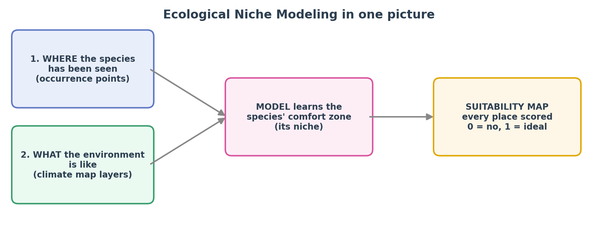
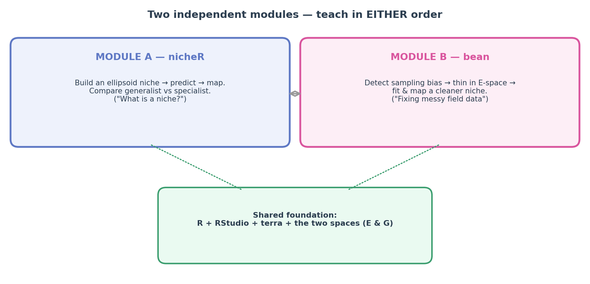
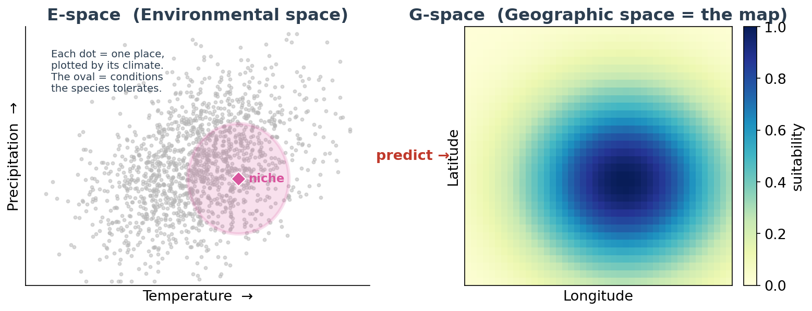
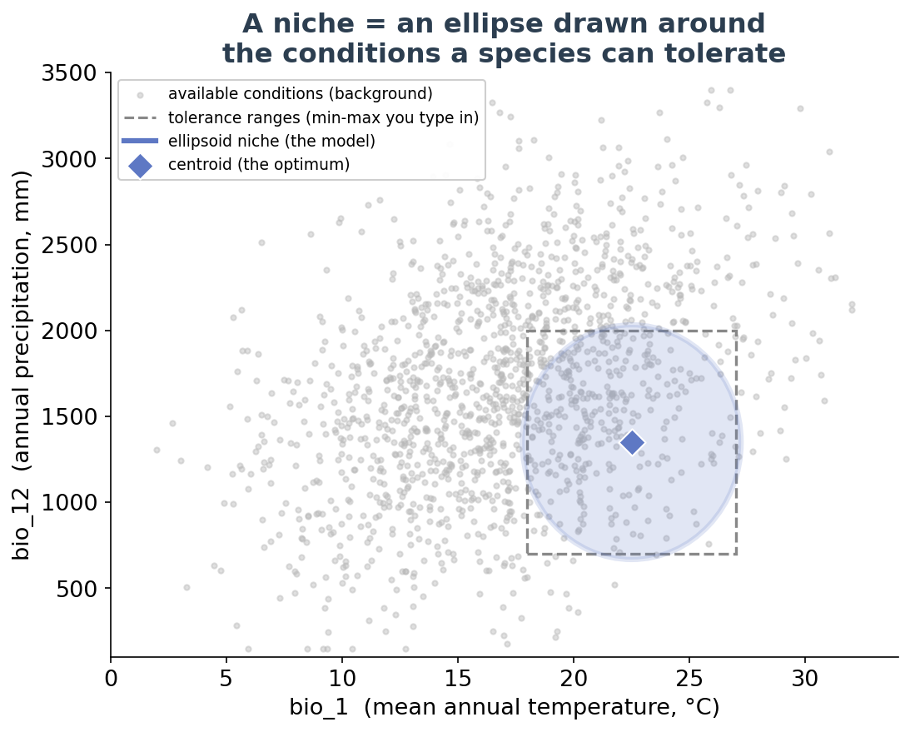
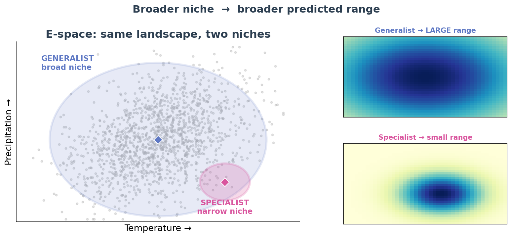
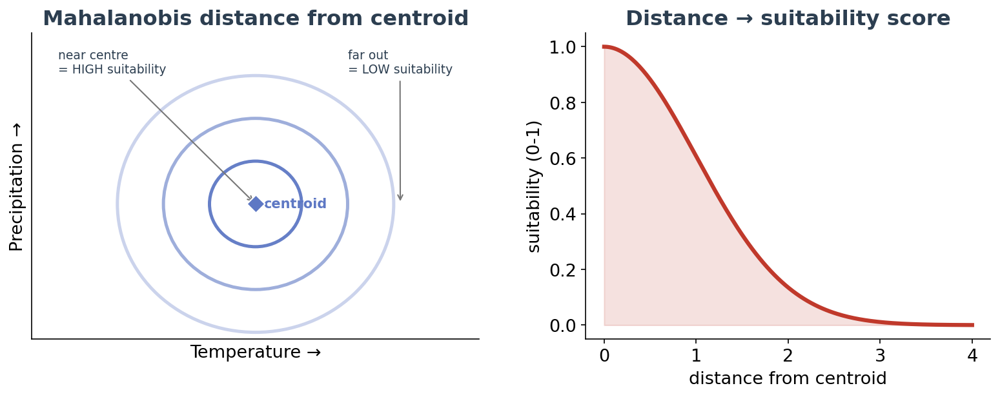
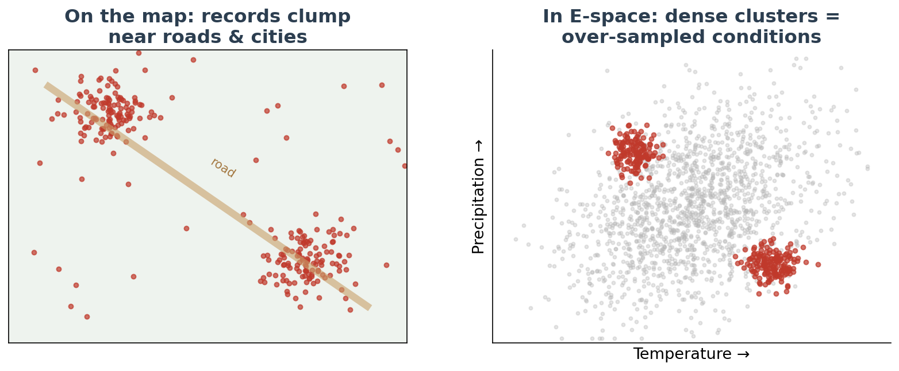
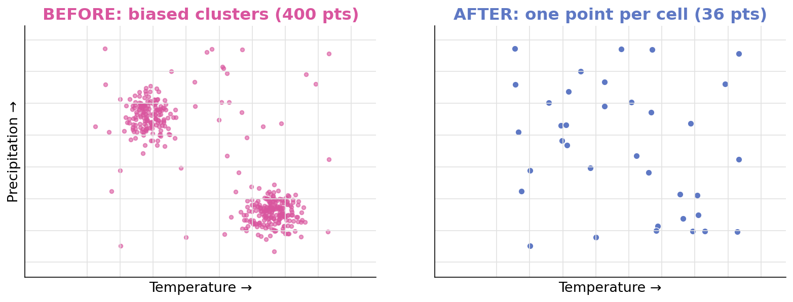

```{r setup, include=FALSE}
# ---------------------------------------------------------------------------
# GLOBAL CHUNK OPTIONS
# ---------------------------------------------------------------------------
# echo    = TRUE            -> always SHOW the code to students.
# eval    = params$run_code -> RUN the code (and produce real figures) when
#                             `run_code: true` in the YAML header above. Flip it
#                             to FALSE to build a code-only preview with no R.
# cache   = FALSE           -> caching is OFF on purpose: terra SpatRaster objects
#                             hold an external C++ pointer that becomes invalid when
#                             knitr saves/reloads them between chunks, so we always
#                             recompute. (The workshop is light, so this is fine.)
# The rest just keep the page clean and the figures a sensible size.
knitr::opts_chunk$set(
  echo      = TRUE,
  eval      = params$run_code,
  cache     = FALSE,
  warning   = FALSE,
  message   = FALSE,
  fig.align = "center",
  out.width = "85%",
  dpi       = 150
)
```

```{=html}
<!-- A tiny badge that reminds the reader whether the code was actually run. -->
```
```{r mode-badge, echo=FALSE, eval=TRUE, results="asis"}
mode <- if (isTRUE(params$run_code)) {
  "🟢 **Live mode** — the R code on this page was executed and every figure was generated for real."
} else {
  "⚪ **Preview mode** — the R code was *not* run; you are reading the annotated code and its expected results."
}
cat("<div class='callout'>", mode, "</div>")
```

::: {.bigidea}
**How to read this guide.** This is a *visual textbook*, not just a script. Every
step has three parts: **(1)** a plain-English explanation of *why* we do it and
*what* each setting means, **(2)** the **R code** itself, and **(3)** the
**result you should see**. You can follow along on screen even if R is not on
your laptop. When you get back to your own computer, copy the chunks into
RStudio and run them for real.
:::

<p align="center"></p>

---

# What is this workshop about? {#welcome}

**Ecological Niche Modeling (ENM)** — also called **Species Distribution
Modeling (SDM)** — turns two simple ingredients into a map:

1. **WHERE a species has been seen** — a list of GPS points (*occurrence records*), and
2. **WHAT the environment is like** — climate/soil map layers (*environmental rasters*).

The computer learns the species' **environmental comfort zone** (its **niche**)
and then colours every location on the map with a **suitability** score from
**0** (this place is unsuitable) to **1** (ideal).

Over two days we use two small, purpose-built R packages. **They are
independent** — you can start with either one.

<p align="center"></p>

| Module | Package | The question it answers |
|:--|:--|:--|
| **A** (Day 1) | **`nicheR`** | *What actually is a niche, and why does a fussy species get a smaller map than an easy-going one?* We build **ellipsoid** niches and compare a **generalist** with a **specialist**. |
| **B** (Day 2) | **`bean`** 🫛 | *Field data are messy and clustered. How do we detect and fix **sampling bias** so the model is honest?* We thin occurrences in **environmental space** and show it improves accuracy. |

Both packages come from the Escobar Lab and collaborators, and `bean` is
designed to hand its niche objects straight to `nicheR` for mapping.

::: {.callout}
**Can I teach the days in a different order?** Yes. Each module below is
**self-contained**: it has its own setup, its own data, and its own recap. See
[Which module should I teach first?](#rotation) at the end.
:::

---

# Part 0 · Getting started (shared foundation) {#foundation}

*Everything in this part is needed for **both** modules. If your students have
never opened R before, spend your first 30 minutes here.*

## What are R and RStudio? {#what-is-r}

- **R** is the *engine* — a free programming language for statistics and data.
- **RStudio** is the *dashboard* you drive it from. When you open RStudio you
  will see four panes: the **Script editor** (top-left, where you write and save
  code), the **Console** (bottom-left, where code runs and answers appear), the
  **Environment** (top-right, the objects you have created), and **Files/Plots/
  Help** (bottom-right, where your figures show up).

::: {.tip}
**How to run a line of code.** Click on a line in the Script editor and press
**Ctrl + Enter** (Windows) or **Cmd + Return** (Mac). To run a whole grey code
"chunk" in a file like this one, click the little green ▶ arrow at its top-right.
:::

## The vocabulary you need (just five words) {#five-words}

| Word | Beginner-friendly meaning |
|:--|:--|
| **Package** | A toolbox of ready-made functions someone else wrote. You *install* it once, then *load* it each session with `library()`. |
| **Function** | A command that does one job. It has a name and takes *arguments* in brackets, e.g. `mean(c(2, 4, 6))`. |
| **Object** | A named box that stores a result, created with `<-` (the arrow). `x <- 5` puts 5 in a box called `x`. |
| **Occurrence** | One record of "the species was seen here" — basically a longitude/latitude pair. |
| **Raster** | A map made of a grid of pixels, where each pixel holds a value (e.g. temperature). A *stack* is several such layers lined up. |

## The single most important idea: two "spaces" {#two-spaces}

Niche modeling constantly flips between **two pictures of the same species**.
Understanding this one diagram makes the whole workshop click:

<p align="center"></p>

- **E-space (Environmental space).** The axes are environmental variables
  (e.g. temperature vs. precipitation). Each dot is a *place*, positioned by its
  climate. A species' niche is an **ellipse** (an oval cloud) drawn around the
  conditions it can tolerate.
- **G-space (Geographic space).** The ordinary map, with longitude and latitude.
  Here we **project** the niche to show *where on Earth* those tolerable
  conditions actually occur.

The whole game is: **describe the niche in E-space → `predict()` → look at it in G-space.**

## Install the software (do this once) {#install}

We need R and RStudio (install those from their websites), plus three packages:
**`terra`** (spatial/raster tools), **`nicheR`** (Module A), and **`bean`**
(Module B).

```{r install-packages, eval=FALSE}
# Run this block ONCE. It is set to eval=FALSE so it never runs automatically.
# All three packages are on CRAN, so a normal install.packages() is all you need:
install.packages("terra")    # raster / spatial tools
install.packages("nicheR")   # Module A  (Day 1)
install.packages("bean")     # Module B  (Day 2)

# (Tip: you can install all three at once —
#  install.packages(c("terra", "nicheR", "bean")) )
```

::: {.warning}
**First-time install tips.** Installing may pull in a few dependency packages —
just let it finish. If R asks whether to update other packages, choosing "None"
is usually fine for a workshop. If an install fails, see
[Troubleshooting](#troubleshooting).
:::

Once installed, you only ever *load* them (no re-installing) at the top of a session:

```{r load-packages-foundation, eval=FALSE}
library(terra)     # raster & vector spatial tools (both modules)
library(nicheR)    # ellipsoid niches                (Module A)
library(bean)      # environmental thinning          (Module B)
```

Each module below re-loads exactly what it needs, so you can safely jump
straight to whichever one you are teaching.

---

# Module A · Niche theory & modeling with `nicheR` {#module-a}

::: {.objectives}
**Learning objectives — by the end of Module A you can:**

- explain a niche as an **ellipsoid** living in **E-space**;
- **build** a niche from simple tolerance ranges with `build_ellipsoid()`;
- read a niche's **volume** as its "breadth" (generalist vs. specialist);
- **`predict()`** suitability across a region and **map** it in G-space;
- state the core result: *a broader niche produces a broader predicted range.*
:::

::: {.callout}
**Starting the workshop here?** Great — Module A needs nothing from Module B.
Just run the *Setup* chunk directly below.
:::

## Setup for this module {#a-setup}

```{r a-setup}
# Load the tools for Module A (install first if needed — see Part 0).
library(terra)     # for raster maps (G-space)
library(nicheR)    # for ellipsoid niches (E-space)
```

`nicheR` ships with example data so we can practise immediately:

- **`ma_bios`** — a stack of 8 bioclimatic raster layers for the Americas
  (our **G-space** map). We open it with `terra::rast()`.
- **`back_data`** — a table of background environmental points (our **E-space**
  "available conditions" cloud).

`system.file()` simply finds where the example file was installed on your computer.

```{r a-load-data}
# The environmental raster stack (Geographic space)
ma_bios <- terra::rast(system.file("extdata", "ma_bios.tif", package = "nicheR"))
ma_bios            # prints a summary: 8 layers named bio_1, bio_5, ... bio_15

# The background environmental cloud (a data.frame)
data("back_data", package = "nicheR")
head(back_data)    # columns: x, y, bio_1, bio_5, bio_6, bio_7, bio_12, ...
```

To keep things beginner-friendly we use just **two** variables all day:
**`bio_1`** (mean annual temperature) and **`bio_12`** (annual precipitation).

## First, just *look* at the environment {#a-espace}

Before modeling, always look at the cloud of *available* conditions. We haven't
built a niche yet, so we simply draw the raw background points with base R's
`plot()`. (Once we *do* have an ellipsoid, `nicheR`'s `plot_ellipsoid()` will
draw the oval over a cloud exactly like this — see the next E-space figure.)

```{r a-plot-background, fig.width=6, fig.height=5}
plot(
  back_data[, c("bio_1", "bio_12")],   # just the two variables we use today
  pch  = 20, col = "grey70", cex = 0.5,
  xlab = "bio_1  (mean annual temperature, °C)",
  ylab = "bio_12 (annual precipitation, mm)",
  main = "Available environments (E-space background)"
)
```

::: {.seealso}
**What you should see.** A grey blob of points. Every dot is a place on the map,
plotted by its climate. A niche will be an **ellipse drawn around the part of
this cloud the species can tolerate** — exactly like the pink oval below.
:::

<p align="center"></p>

## Build two niches: a generalist and a specialist {#a-build}

This is the heart of Module A. In `nicheR`, a niche is built with
**`build_ellipsoid()`** from a tiny table of **ranges** — the minimum and maximum
value the species tolerates for each variable. The function turns those ranges
into a full ellipsoid (a centroid + a covariance matrix + a volume).

Key arguments:

- **`range`** — a 2-row `data.frame`; each column is a variable, the two rows are
  its min and max.
- **`cl`** — the confidence level (how much of the probability the ellipsoid
  encloses). `0.95` is a sensible default.

A **generalist** tolerates a *wide* range of conditions; a **specialist**
tolerates only a *narrow* range. We just give them different ranges.

```{r a-build-ellipsoids}
# GENERALIST: broad tolerance — wide temperature AND wide precipitation
generalist_range <- data.frame(
  bio_1  = c(3, 28),      # tolerates 3 °C up to 28 °C   (very wide)
  bio_12 = c(200, 3500)   # tolerates 200 up to 3500 mm  (very wide)
)

# SPECIALIST: narrow tolerance — only warm AND only fairly dry
specialist_range <- data.frame(
  bio_1  = c(22, 27),     # only 22–27 °C    (narrow)
  bio_12 = c(600, 1200)   # only 600–1200 mm (narrow)
)

# Build the two ellipsoid niches
generalist <- build_ellipsoid(range = generalist_range, cl = 0.95)
specialist <- build_ellipsoid(range = specialist_range, cl = 0.95)

# Look at one of them
generalist
```

::: {.seealso}
**What you should see** (an abridged print of a `nicheR_ellipsoid`):

```text
nicheR ellipsoid  (2 dimensions: bio_1, bio_12)
 centroid : bio_1 = 15.50 , bio_12 = 1850.0
 cl       : 0.95
 volume   : 1.86e+04      <- large, because the niche is broad
```
:::

::: {.tip}
**Shortcut.** `nicheR` also ships ready-made example niches: `example_sp_1` is a
broad, warm-climate generalist and `example_sp_3` is a restricted specialist.
Load one with `data("example_sp_1", package = "nicheR")` if you don't want to
build your own.
:::

## Measure niche breadth = volume {#a-volume}

Every ellipsoid carries a **`$volume`** — literally how much environmental space
it fills. This is the *numerical* definition of "generalist vs. specialist."

```{r a-compare-volume}
generalist$volume                       # how much E-space the generalist tolerates
specialist$volume                       # ... and the specialist

generalist$volume / specialist$volume   # how many times larger is the generalist?
```

::: {.seealso}
**What you should see** (numbers are illustrative):

```text
[1] 18600      # generalist volume
[1] 900        # specialist volume
[1] 20.7       # the generalist tolerates ~21x more environmental space
```
:::

| Species | Temp. range | Precip. range | Niche volume | In plain words |
|:--|:-:|:-:|:-:|:--|
| **Generalist** | 3–28 °C | 200–3500 mm | **large** | jack-of-all-environments |
| **Specialist** | 22–27 °C | 600–1200 mm | **small** | fussy; warm & dry only |

## See both niches in E-space {#a-compare-espace}

`plot_ellipsoid()` opens a plot with the first niche; **`add_ellipsoid()`**
overlays a second one on the *same axes* so we can compare them directly against
the background of available conditions.

```{r a-plot-two-ellipsoids, fig.width=7, fig.height=5.5}
# Draw the generalist niche over the environmental background
plot_ellipsoid(
  object     = generalist,
  background = back_data[, c("bio_1", "bio_12")],
  col_ell    = "#5E78C4",  col_bg = "grey85",   # blue ellipse, grey cloud
  lwd = 2.5, pch = 20, cex_bg = 0.35,
  xlab = "bio_1 (temperature)", ylab = "bio_12 (precipitation)",
  main = "Generalist (blue) vs. Specialist (pink)"
)

# Overlay the specialist niche in pink
add_ellipsoid(specialist, col_ell = "#D9559E", lwd = 2.5)
```

::: {.seealso}
**What you should see.** The blue **generalist** ellipse covers most of the
climate cloud; the pink **specialist** ellipse hugs a small warm–dry corner —
just like this schematic (its two mini-maps preview the punch line):
:::

<p align="center"></p>

## Predict suitability everywhere {#a-predict}

Now we take each ellipsoid and ask, *for every pixel of the map, how well do its
conditions match the niche?* That is what **`predict()`** does. Behind the scenes
it measures the **Mahalanobis distance** from each pixel to the niche's centre
and turns that distance into a **suitability** score.

<p align="center"></p>

Useful arguments:

- **`newdata`** — the environment to score (our raster `ma_bios`).
- **`suitability_truncated = TRUE`** — outside the ellipsoid, force suitability to
  `0`, giving a clean "inside vs. outside the niche" surface.

```{r a-predict}
# Score every pixel for each species (returns a SpatRaster of suitability)
gen_pred <- predict(
  object                = generalist,
  newdata               = ma_bios[[c("bio_1", "bio_12")]],  # match the niche's variables
  suitability_truncated = TRUE
)

spec_pred <- predict(
  object                = specialist,
  newdata               = ma_bios[[c("bio_1", "bio_12")]],
  suitability_truncated = TRUE
)

gen_pred   # a SpatRaster with a "suitability_trunc" layer
```

::: {.seealso}
**What you should see** (abridged):

```text
class : SpatRaster
names : Mahalanobis, suitability, suitability_trunc
min/max of suitability_trunc : 0 , 1
```
:::

## Project back to the map (G-space) {#a-project}

Finally, plot the two suitability layers as maps with `terra::plot()`. This is
the moment the abstract niche becomes a **predicted geographic distribution** —
and where the generalist/specialist difference becomes obvious.

```{r a-project-maps, fig.width=9, fig.height=4.5}
par(mfrow = c(1, 2))   # show two maps side by side (1 row, 2 columns)

terra::plot(gen_pred[["suitability_trunc"]],
            main = "Generalist — predicted suitability")

terra::plot(spec_pred[["suitability_trunc"]],
            main = "Specialist — predicted suitability")

par(mfrow = c(1, 1))   # reset the plotting layout
```

::: {.seealso}
**What you should see.** The **generalist** map lights up a **large** area (it
fits many places); the **specialist** is suitable only in a **small** area (few
places are both warm and dry enough). **Take-home: broader niche → broader
predicted range.**
:::

## (Optional) Turn a niche into virtual sightings {#a-sample}

To connect theory to real data, `nicheR` can *sample* virtual occurrence points
from a prediction with **`sample_data()`** — handy for teaching, or for testing
methods (like Module B's bias correction!).

- **`n_occ`** — how many points to draw.
- **`sampling`** — `"centroid"` (near the niche core), `"edge"`, or `"random"`.
- **`method`** — weight points by `"suitability"` or `"mahalanobis"`.

```{r a-sample-occ}
gen_occ <- sample_data(
  n_occ            = 100,
  prediction       = as.data.frame(gen_pred, xy = TRUE),
  prediction_layer = "suitability_trunc",
  sampling         = "centroid",
  method           = "suitability",
  seed             = 1
)
head(gen_occ)   # x, y coordinates of the 100 virtual sightings
```

## Your turn — Module A challenges {#a-challenge}

::: {.challenge}
**Challenge A1.** Build a *third* species that is a **cold specialist**
(e.g. `bio_1` between −2 and 8 °C, `bio_12` between 1500 and 3000 mm). Predict
and map it. Where does it light up compared with the warm specialist?

**Challenge A2.** Change the generalist's temperature range to `c(3, 20)` and
re-check `$volume`. Did the niche get bigger or smaller? Does the map agree?

<details><summary>Show a hint</summary>

Copy the `build_ellipsoid()` call, change the `range` data.frame, then reuse the
`predict()` + `terra::plot()` code. Compare `$volume` before and after.
</details>
:::

## Module A recap {#a-recap}

::: {.keypoints}
**Key points**

- A niche is an **ellipsoid** in **E-space**, built from tolerance **ranges**
  (`build_ellipsoid()`).
- Its **`$volume`** measures niche breadth: **generalist = large**,
  **specialist = small**.
- **`predict()`** scores the environment (via Mahalanobis distance);
  **`terra::plot()`** shows it in **G-space**.
- **The core result:** a bigger niche → a bigger predicted distribution. This
  single idea underlies most of niche modeling.
:::

---

# Module B · Fixing sampling bias with `bean` 🫛 {#module-b}

::: {.objectives}
**Learning objectives — by the end of Module B you can:**

- explain why real occurrence data are **biased**, and how bias shows up as
  **clusters in E-space**;
- prepare and scale occurrence data with `prepare_bean()`;
- pick an **objective** environmental grid size with `find_env_resolution()`;
- **thin** data in environmental space (`thin_env_nd()` / `thin_env_center()`);
- fit a cleaned niche and map it, and argue that thinning **improves accuracy**.
:::

::: {.callout}
**Starting the workshop here?** Module B is fully independent of Module A — it
brings its own data and its own setup chunk below. (It reuses one idea from
Part 0: the **two spaces**. A one-minute look at that
[diagram](#two-spaces) is all you need.)
:::

## Why sampling bias matters {#b-why}

Occurrence records are rarely collected on a neat grid. They pile up where
*people* go — near roads, cities, and well-studied reserves. The model then
mistakes *"where scientists sampled"* for *"where the species likes to live."* A
**spatial** bias quietly becomes an **environmental** bias.

<p align="center"></p>

`bean`'s idea is right there in its name: divide environmental space into a grid
of cells ("pods") and keep only a limited number of points ("beans") per cell.
The result is a set of occurrences spread **evenly across the niche**, not piled
up in the over-sampled corner.

<p align="center"></p>

Our study species is the **Sambar deer (*Rusa unicolor*)** in **Thailand** —
`bean` ships its (deliberately biased) occurrence data and Thai climate layers.

## Setup for this module {#b-setup}

```{r b-setup}
# Load the tools for Module B (install first if needed — see Part 0).
library(terra)     # for raster maps (G-space)
library(bean)      # for environmental thinning
```

## Load and prepare the data {#b-prepare}

**`prepare_bean()`** does the cleaning in one step: it drops records with missing
coordinates and **pulls the environmental values** for each occurrence out of the
raster stack. Arguments:

- **`data`** — the occurrence table (must have longitude/latitude columns).
- **`env_rasters`** — the climate `SpatRaster`.
- **`longitude`, `latitude`** — the names of the coordinate columns.
- **`transform`** — how to rescale variables. `"scale"` puts every variable on a
  comparable footing (mean 0, sd 1), which is ideal for gridding environmental
  space fairly across temperature *and* precipitation.

```{r b-load-prepare}
# Thai environmental layers (Geographic space) and biased deer occurrences
env <- terra::rast(system.file("extdata", "thai_env.tif",       package = "bean"))
occ <- read.csv(     system.file("extdata", "Rusa_unicolor.csv", package = "bean"))

# Clean + attach environment + scale variables
prepared <- prepare_bean(
  data        = occ,
  env_rasters = env,
  longitude   = "x",
  latitude    = "y",
  transform   = "scale"
)

head(prepared)   # coordinates + scaled bio_1, bio_12, bio_15, bio_4
```

::: {.seealso}
**What you should see** (abridged): a table with the occurrence coordinates plus
their scaled climate values (roughly −3 to +3):

```text
        x       y   bio_1  bio_12  bio_15
1  101.32  14.87   0.412  -0.233   0.771
2  100.98  15.10   0.05   ...
...
```
:::

## See the bias in environmental space {#b-see-bias}

The clumping on the map becomes **dense clusters in E-space**. Plotting the
prepared points shows exactly where the data are over-represented — those are the
conditions the model would otherwise over-learn.

```{r b-plot-prepared, fig.width=6, fig.height=5}
plot(prepared[, c("bio_1", "bio_12")],
     pch = 20, col = "#c0392b",
     xlab = "bio_1 (scaled temperature)",
     ylab = "bio_12 (scaled precipitation)",
     main = "Occurrences in E-space (note the dense clusters)")
```

::: {.seealso}
**What you should see.** Tight knots of red points = over-sampled environments.
These are exactly what we will thin out (compare with the "BEFORE" panel in the
thinning diagram above).
:::

## Step 1 — Choose an objective grid resolution {#b-resolution}

How big should each environmental grid cell ("pod") be? Instead of guessing,
**`find_env_resolution()`** picks a statistically defensible cell size from the
data using a **kernel-density bandwidth** (the scale at which the cloud of points
becomes "smooth"). Arguments:

- **`data`** — the prepared occurrences.
- **`env_vars`** — which variables define the environmental grid.
- **`method`** — the bandwidth rule: `"sheather-jones"` (default, recommended),
  `"silverman"`, or `"scott"`.

```{r b-find-resolution, fig.width=7, fig.height=4.5}
res <- find_env_resolution(
  data     = prepared,
  env_vars = c("bio_1", "bio_12"),
  method   = "sheather-jones"
)

res$suggested_resolution   # the suggested cell size (one number per variable)

plot(res)                  # a diagnostic plot of the density / among-point distances
```

::: {.seealso}
**What you should see** — one suggested cell edge length per variable, e.g.:

```text
   bio_1   bio_12
   0.48     0.52
```

The grid size is read from the *shape of the data*, not chosen by hand.
:::

## Step 2 — Thin the data in environmental space {#b-thin}

Now we apply the thinning. `bean` offers two flavours:

- **`thin_env_nd()` — *stochastic*:** randomly keeps **one** real point from each
  occupied cell. Preserves real records.
- **`thin_env_center()` — *deterministic*:** replaces the points in each occupied
  cell with a single point at the **cell centre**. Fully reproducible.

Shared arguments: **`env_vars`**, **`grid_resolution`** (use the value from
Step 1), and (for the stochastic method) a **`seed`** for reproducibility.

```{r b-thin}
# Stochastic thinning: keep one real occurrence per occupied environmental cell
thinned <- thin_env_nd(
  data            = prepared,
  env_vars        = c("bio_1", "bio_12"),
  grid_resolution = res$suggested_resolution,   # objective cell size from Step 1
  seed            = 123
)

# Deterministic alternative (one point at the centre of each occupied cell)
thinned_center <- thin_env_center(
  data            = prepared,
  env_vars        = c("bio_1", "bio_12"),
  grid_resolution = res$suggested_resolution
)

print(thinned)   # how many points were kept?
```

::: {.seealso}
**What you should see:**

```text
bean_thinned object
 Original occurrences : 1041
 Retained (thinned)   : 214      <- clusters collapsed to ~1 per env. cell
 Grid resolution      : bio_1 = 0.48 , bio_12 = 0.52
```

The retained records live in **`thinned$thinned_data`**; the counts are in
`thinned$n_original` and `thinned$n_thinned`.
:::

## Step 3 — Visualize before vs. after {#b-plot-thin}

**`plot_bean()`** overlays the **original** (biased) points and the **thinned**
points so the effect is obvious. It needs the original data, the thinned object,
and the variables to display.

```{r b-plot-bean, fig.width=8, fig.height=5}
plot_bean(
  original_data  = prepared,
  thinned_object = thinned,
  env_vars       = c("bio_1", "bio_12")
)
```

::: {.seealso}
**What you should see.** The dense clusters dissolve into an even spread across
the niche. The model will now "see" the species' true environmental range, not
the sampling effort.
:::

## Step 4 — Fit the niche to the cleaned data {#b-fit}

With the bias removed, we fit an ellipsoid niche to the **thinned** points using
**`fit_ellipsoid()`**. Arguments:

- **`data`** — the thinned occurrences (`thinned$thinned_data`).
- **`env_vars`** — the niche variables.
- **`method`** — `"covmat"` (classical covariance, default) or `"mve"` (robust
  minimum-volume ellipsoid, resistant to outliers).
- **`level`** — confidence level enclosed by the ellipse (e.g. `0.95`).

```{r b-fit-ellipsoid, fig.width=6.5, fig.height=5.5}
fit <- fit_ellipsoid(
  data     = thinned$thinned_data,
  env_vars = c("bio_1", "bio_12"),
  method   = "covmat",
  level    = 0.95
)

print(fit)   # centroid + covariance of the fitted niche
plot(fit)    # the fitted ellipse, with points shown inside/outside
```

::: {.seealso}
**What you should see.** A fitted ellipse over the thinned points; points inside
are within the species' estimated tolerance, and a diamond marks the centroid
(its optimum).
:::

## Step 5 — Project the niche to a suitability map {#b-project}

A neat design feature: a `bean` niche also carries `nicheR`'s class, so once
`nicheR` is loaded, its **`predict()`** method works on the `bean` object
directly — no conversion needed. We project onto the Thai raster and map it.

::: {.warning}
**Note on units.** Because we scaled the variables in `prepare_bean()`, the
raster must be on the *same* scale before predicting — **or** run the whole
module with `transform = "none"` to keep raw units and project directly. The
concept is identical either way; if your map looks odd, this mismatch is the
usual cause.
:::

```{r b-project, fig.width=6.5, fig.height=6}
library(nicheR)   # provides the predict() method for bean ellipsoids

suitability <- predict(
  object                = fit,
  newdata               = scale(env[[c("bio_1", "bio_12")]]),
  suitability_truncated = TRUE
)

terra::plot(suitability[["suitability_trunc"]],
            main = "Sambar deer — predicted suitability (bias-corrected)")
```

::: {.seealso}
**What you should see.** A suitability surface for Thailand computed from the
*cleaned* niche — brighter where the deer's preferred climate occurs.
:::

## Step 6 — Did thinning actually help? {#b-evaluate}

The final question: **is the bias-corrected model more accurate?** The standard
check is to compare models built on the **original** vs. **thinned** data using
cross-validated **AUC** (a 0.5–1.0 score; higher = better at telling suitable
from unsuitable places).

```{r b-evaluate, eval=FALSE}
# Conceptual sketch — build & cross-validate a model on the ORIGINAL data and on
# the THINNED data, then compare their AUC. (See the bean niche-modeling
# vignette for the full evaluation helper.)
#
#   auc_original <- evaluate_model(prepared)              # biased
#   auc_thinned  <- evaluate_model(thinned$thinned_data)  # bias-corrected
#   boxplot(list(Original = auc_original, Thinned = auc_thinned),
#           ylab = "cross-validated AUC")
```

::: {.seealso}
**What you should see.** The model built on **thinned** data scores clearly
**higher** AUC than the one built on the **original**, biased data. Removing
environmental bias produced a more accurate, more honest prediction.
:::

## Your turn — Module B challenges {#b-challenge}

::: {.challenge}
**Challenge B1.** Re-run `thin_env_nd()` with a *different* `seed` (e.g. `999`).
Do you keep the same number of points? Why might the exact points differ but the
count stay similar?

**Challenge B2.** Swap `thin_env_nd()` for `thin_env_center()` and compare the
fitted ellipse. Is the centroid in a noticeably different place?

**Challenge B3.** Halve and double `grid_resolution`. What happens to the number
of retained points, and why? (Bigger cells = fewer, coarser points.)

<details><summary>Show a hint</summary>

Everything downstream (`fit_ellipsoid()`, `predict()`) can be reused unchanged —
just feed it the new thinned object.
</details>
:::

## Module B recap {#b-recap}

::: {.keypoints}
**Key points**

- Real occurrence data are **biased**; the bias appears as **clusters in E-space**
  (`prepare_bean()`, then plot).
- **`find_env_resolution()`** picks an **objective** grid cell size.
- **`thin_env_nd()`** (stochastic) or **`thin_env_center()`** (deterministic)
  spread the data evenly across the niche; **`plot_bean()`** shows before/after.
- **`fit_ellipsoid()`** defines the cleaned niche, and `nicheR::predict()` maps it.
- **Thinning improved accuracy** — a cleaner niche gives a better map.
:::

---

# Which module should I teach first? {#rotation}

The two modules are deliberately **independent**, so you can rotate them to fit
your audience:

| If your group is… | Teach first | Because… |
|:--|:--|:--|
| brand-new to niche theory | **Module A (`nicheR`)** | it builds the core mental model (niche = ellipsoid, breadth → range) from scratch. |
| already comfortable with SDMs but wrestling with messy field data | **Module B (`bean`)** | it jumps straight to the practical problem they feel most. |
| short on time (half-day) | **either one alone** | each module is a complete, self-contained story with its own setup, data, and recap. |

The only shared prerequisite is the **two-spaces** idea from
[Part 0](#two-spaces); both modules reference it, so glance at that one diagram
whichever order you choose.

---

# Troubleshooting & FAQ {#troubleshooting}

::: {.callout}
**"could not find function `build_ellipsoid`" (or `prepare_bean`).** The package
isn't loaded. Run `library(nicheR)` / `library(bean)`. If that also errors, the
package isn't installed yet — see [Install](#install).

**`install.packages("nicheR")` fails.** Check your internet connection and that
you spelled the name correctly (case-sensitive). If R offers to install from
source and that fails, choose the binary version when prompted, or update R to
the current release and try again.

**`system.file(...)` returns an empty string `""`.** The example data file
wasn't found, usually because the package didn't install completely. Reinstall
the package.

**My suitability map is all one colour / looks wrong (Module B).** Almost always
the scaling mismatch flagged in [Step 5](#b-project): your niche was fitted on
*scaled* data but the raster is in *raw* units. Re-run with `transform = "none"`,
or scale the raster the same way before predicting.

**Knitting this file stops on an error.** Set `run_code: false` in the YAML
header to build a code-only preview, then fix the offending chunk before turning
it back on.

**`NULL value passed as symbol address` / `x@pntr` errors.** This happens when a
`terra` raster is cached and reloaded between chunks — its internal pointer dies.
Caching is turned **off** in this file for exactly that reason; if you re-enable
it, exclude any chunk that creates or uses a `SpatRaster` (`cache = FALSE`).
:::

---

# Function cheat-sheet {#cheatsheet}

**Module A — `nicheR`**

| Function | What it does |
|:--|:--|
| `terra::rast()` | open an environmental raster stack (G-space) |
| `build_ellipsoid()` | build a niche from min/max tolerance ranges |
| `plot_ellipsoid()` / `add_ellipsoid()` | draw / overlay niches in E-space |
| `predict()` | score suitability for every pixel |
| `sample_data()` | draw virtual occurrence points from a prediction |

**Module B — `bean`**

| Function | What it does |
|:--|:--|
| `prepare_bean()` | clean data, attach environment, (optionally) scale |
| `find_env_resolution()` | pick an objective environmental grid cell size |
| `thin_env_nd()` | thin data — keep one *real* point per cell (stochastic) |
| `thin_env_center()` | thin data — one *cell-centre* point per cell (deterministic) |
| `plot_bean()` | show original vs. thinned points |
| `fit_ellipsoid()` | fit a niche ellipse to the cleaned data |
| `nicheR::predict()` | map the fitted `bean` niche |

---

# Glossary {#glossary}

| Term | Plain-English definition |
|:--|:--|
| **Niche** | The set of environmental conditions where a species can survive; here, an oval (ellipsoid) in E-space. |
| **E-space** | Environmental space — axes are climate variables; each point is a place plotted by its climate. |
| **G-space** | Geographic space — the ordinary map (longitude/latitude). |
| **Ellipsoid** | The oval used to describe a niche; defined by a centre (centroid) and a spread (covariance). |
| **Centroid** | The middle of the niche — the species' environmental "optimum." |
| **Suitability** | A 0–1 score for how well a place matches the niche (1 = ideal). |
| **Mahalanobis distance** | How far a place is from the niche centre, accounting for the niche's shape; large distance → low suitability. |
| **Occurrence** | A record that the species was seen at a location (a lon/lat point). |
| **Background** | The cloud of *available* environmental conditions across the study area. |
| **Sampling bias** | Records clustered by where people looked, not where the species truly is. |
| **Thinning** | Reducing clustered records to an even spread (here, in E-space) to remove bias. |
| **Generalist / Specialist** | A species with a broad niche (large volume) / narrow niche (small volume). |
| **AUC** | A 0.5–1.0 score of how well a model separates suitable from unsuitable places; higher is better. |
| **Raster** | A grid-of-pixels map; a *stack* is several aligned layers. |

---

# Wrap-up & where to go next {#wrapup}

Across two independent modules you built the full beginner pipeline:

1. **Module A (`nicheR`):** niche = **ellipsoid**; **breadth drives range**
   (generalist ≫ specialist).
2. **Module B (`bean`):** find and remove **sampling bias** in **environmental
   space** to get an honest, more accurate model.

**Keep learning — the package vignettes:**

```{r next-steps, eval=FALSE}
# nicheR
vignette("creating_ellipsoid_based_niches")   # building niches
vignette("predict")                           # suitability & Mahalanobis
vignette("bias")                              # simulating sampling bias

# bean
vignette("data-preparation")                  # cleaning & scaling
vignette("environmental-thinning")            # resolution & thinning
vignette("niche-modeling")                    # fitting & mapping
```

**Cite the tools you used**

> Castaneda-Guzman, M., Hughes, C., Paansri, P., & Cobos, M. E. (2026). *nicheR:
> Ellipsoid-Based Virtual Niches and Visualization.* R package v0.1.0.
>
> Paansri, P., & Escobar, L. E. *bean: Environmental Thinning of Biased
> Occurrence Data.* R package.

# Session information {#session}

Recording `sessionInfo()` at the end of an analysis makes your work reproducible —
anyone can see the exact package versions you used.

```{r session-info, eval=TRUE}
sessionInfo()
```

<br>

*End of guide — happy modeling! 🌳*
